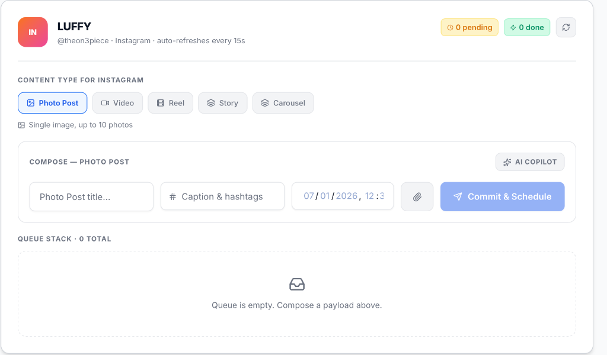
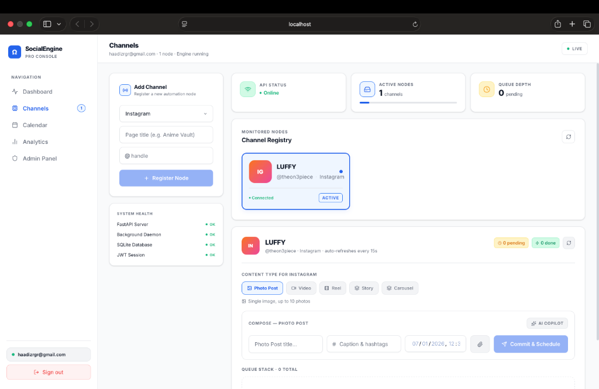
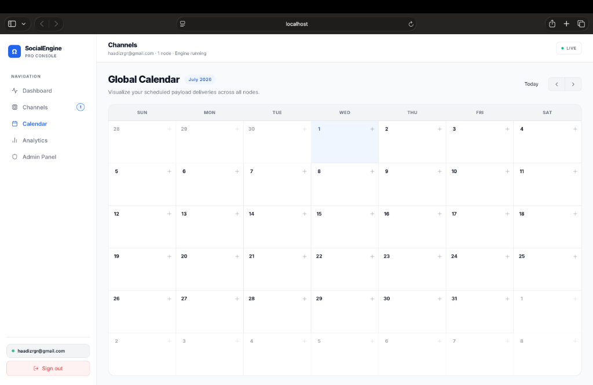
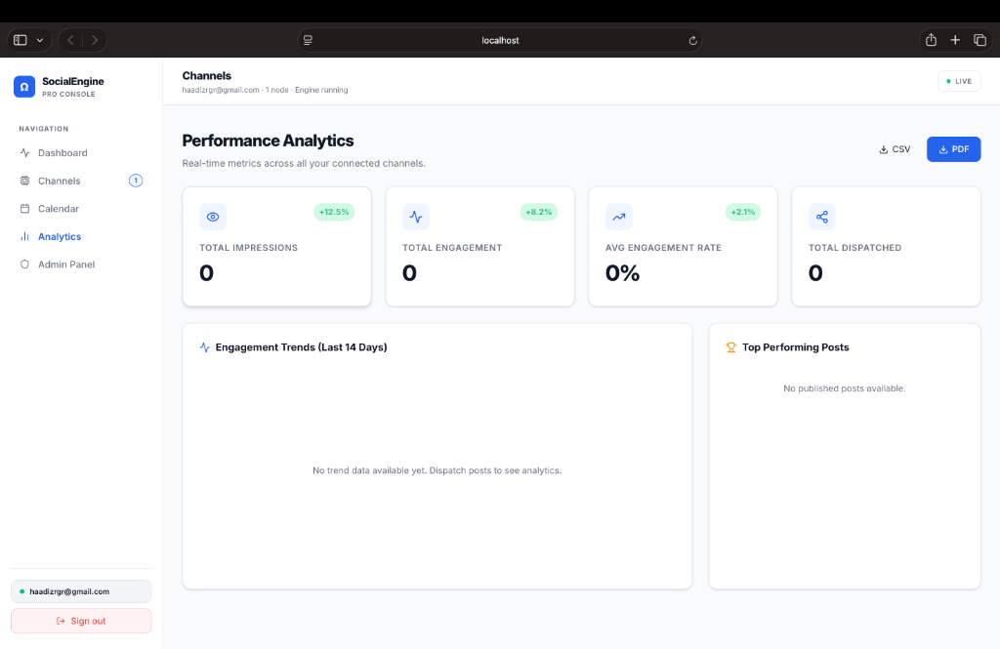
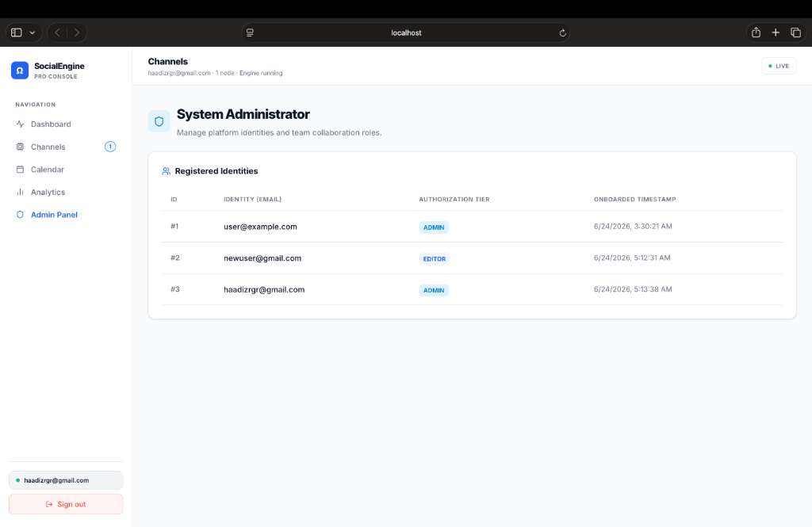

# Social Engine SaaS

## 📝 Project Overview

Social Engine SaaS is a full-stack social media management prototype that helps users manage multiple social media accounts from a single dashboard. The application allows users to schedule posts, generate AI-assisted content, view analytics, and manage connected social media platforms through a modern web interface.

This project was developed as a third-year Computer Science portfolio project at Taylor's University to strengthen my skills in full-stack web development, REST API development, authentication, database management, asynchronous task processing, and modern frontend development.

**Project Status:** Functional Prototype

---

## 🚀 Features

* Secure user authentication using JWT
* Role-Based Access Control (RBAC)
* Connect multiple social media accounts through simulated OAuth
* Schedule and manage social media posts
* AI-powered content generation (captions, hashtags, and post ideas)
* Background task processing using Celery
* Analytics dashboard with engagement metrics
* Media upload support with local storage fallback
* Responsive user interface built with React and Tailwind CSS

---

## 🛠️ Tech Stack

### Frontend

* React
* Vite
* Tailwind CSS
* Recharts

### Backend

* Python
* FastAPI
* SQLAlchemy
* JWT Authentication
* bcrypt

### Database & Infrastructure

* PostgreSQL
* Redis
* Docker Compose
* Celery

---

## 📂 Project Structure

```text
Social-Engine-SaaS/
│
├── frontend/
│   ├── src/
│   ├── public/
│   └── package.json
│
├── backend/
│   ├── main.py
│   ├── worker.py
│   ├── requirements.txt
│   └── ...
│
├── docker-compose.yml
└── README.md
```

---

## 💻 Getting Started

### 1. Start the databases

```bash
docker-compose up -d
```

### 2. Start the backend

```bash
cd backend
pip install -r requirements.txt
uvicorn main:app --reload
```

### 3. Start the Celery worker

Open a new terminal and run:

```bash
cd backend
celery -A worker celery_app worker --loglevel=info
```

### 4. Start the frontend

Open another terminal and run:

```bash
cd frontend
npm install
npm run dev
```

The application will now be available locally.

---

## 📸 Screenshots

### Login Page


---

### Dashboard


---

### Create Post



---

### Channels



---

### Calendar



---

### Analytics Dashboard



---

### Admin Panel



---

## 🎯 Learning Outcomes

Through this project, I gained experience with:

* Building full-stack web applications
* Developing REST APIs using FastAPI
* JWT authentication and user authorization
* Working with PostgreSQL databases
* Background task processing using Celery and Redis
* Containerization using Docker Compose
* Building responsive React applications
* Integrating frontend and backend systems

---

## 🔮 Future Improvements

* Support for additional social media platforms
* Real AI integration using large language models
* Team collaboration features
* Advanced analytics and reporting
* Push notifications
* Cloud deployment
* Multi-language support

---

## 👨‍💻 Author

**Haadi Zargar**
Third-Year Computer Science Student
Taylor's University